# 🔬 Breast Cancer Histopathology Detection
### Binary Classification using Deep Learning Ensemble

[](https://python.org)
[](https://pytorch.org)
[](https://www.kaggle.com/code/kanchansaxena8808/breakhis-bcd-finalvers)
[](LICENSE)
[](https://huggingface.co/spaces/kanchansaxena/breast-cancer-detection)

> **M.Sc. Semester 4 Project**
> **Kanchan Saxena**
> Department of Computer Science, University of Lucknow

---

## 📌 Table of Contents

- [Overview](#overview)
- [Results](#results)
- [Dataset](#dataset)
- [Pipeline](#pipeline)
- [Model Architecture](#model-architecture)
- [Evaluation](#evaluation)
- [Interpretability](#interpretability)
- [Repository Structure](#repository-structure)
- [How to Run](#how-to-run)
- [Limitations](#limitations)
- [References](#references)

---

## 📖 Overview

This project presents an end-to-end deep learning system for binary classification of breast histopathology images into **Benign** and **Malignant** categories using the **BreaKHis dataset**. Three pretrained CNN architectures — EfficientNetB3, DenseNet121, and ResNet50 — are trained independently and combined through a **weighted soft-voting ensemble** to produce the final prediction.

The system includes full model interpretability through **Grad-CAM** heatmaps, **LIME** superpixel explanations, and intermediate feature map visualizations, making the model's decision-making process transparent and clinically explainable.

> ⚠️ This project is developed for **academic research purposes only** and is not intended for clinical diagnosis or medical decision-making.

---

## 🏆 Results

### Test Set Performance

| Model | Accuracy | F1 Score | AUC-ROC | Cohen Kappa | Benign Sensitivity | Malignant Sensitivity |
|-------|----------|----------|---------|-------------|-------------------|----------------------|
| EfficientNetB3 | 0.8595 | 0.8707 | 0.9440 | 0.7176 | 0.8942 | 0.8331 |
| DenseNet121 | 0.8570 | 0.8729 | 0.9333 | 0.7094 | 0.8465 | 0.8649 |
| ResNet50 | 0.7854 | 0.7808 | 0.9177 | 0.5810 | 0.9329 | 0.6731 |
| **Ensemble (Proposed)** | **0.8789** | **0.8884** | **0.9541** | **0.7566** | **0.9180** | **0.8490** |

### Validation Set Performance

| Model | Accuracy | F1 Score | AUC-ROC | Cohen Kappa | Benign Sensitivity | Malignant Sensitivity |
|-------|----------|----------|---------|-------------|-------------------|----------------------|
| EfficientNetB3 | 0.8759 | 0.8946 | 0.9754 | 0.7465 | 0.9717 | 0.8222 |
| DenseNet121 | 0.8647 | 0.8828 | 0.9764 | 0.7273 | 0.9887 | 0.7952 |
| ResNet50 | 0.8230 | 0.8418 | 0.9546 | 0.6503 | 0.9802 | 0.7349 |
| **Ensemble (Proposed)** | **0.8627** | **0.8804** | **0.9752** | **0.7241** | **0.9943** | **0.7889** |

> Sensitivity = Recall for each class.
> The Ensemble achieves the best overall test performance — highest F1 (0.8884), AUC-ROC (0.9541), and Kappa (0.7566).
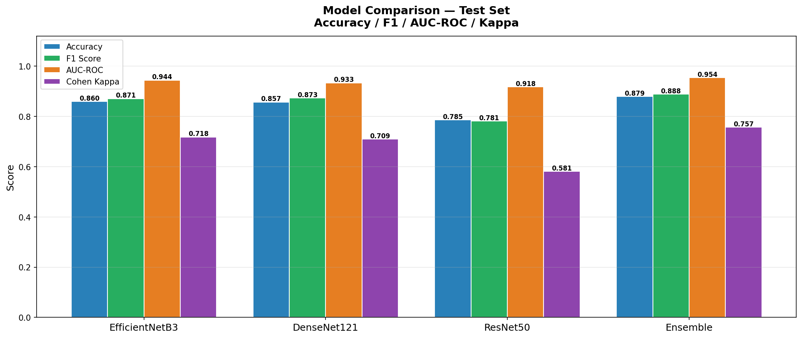
*Figure 1: Model comparison on test set — Accuracy, F1, AUC-ROC, and Cohen Kappa*

---


---

## 🗂️ Dataset

**BreaKHis — Breast Cancer Histopathological Image Database**

| Property | Value |
|----------|-------|
| Total images | 7,909 |
| Unique patients | 82 |
| Binary classes | 2 (Benign / Malignant) |
| Subtypes | 8 (4 benign + 4 malignant) |
| Magnifications | 40×, 100×, 200×, 400× |
| Image format | PNG |
| Source | [Kaggle — BreaKHis](https://www.kaggle.com/datasets/ambarish/breakhis) |

### Class Distribution

| Class | Subtype | Images |
|-------|---------|--------|
| Benign | Adenosis | 444 |
| Benign | Fibroadenoma | 1,014 |
| Benign | Phyllodes Tumor | 453 |
| Benign | Tubular Adenoma | 569 |
| Malignant | Ductal Carcinoma | 3,451 |
| Malignant | Lobular Carcinoma | 626 |
| Malignant | Mucinous Carcinoma | 792 |
| Malignant | Papillary Carcinoma | 560 |
| | **Total** | **7,909** |

### Data Split (Patient-level — zero leakage)

| Split | Images | Patients |
|-------|--------|----------|
| Train | 5,374 | 54 |
| Validation | 983 | 11 |
| Test | 1,552 | 16 |

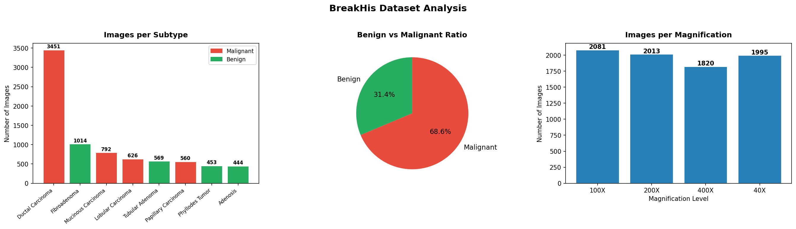
*Figure 2: Class distribution — images per subtype and Benign vs Malignant ratio*

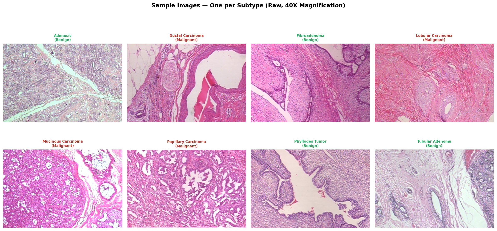
*Figure 3: Sample histopathology images — one per subtype at 40× magnification*


---

## ⚙️ Pipeline


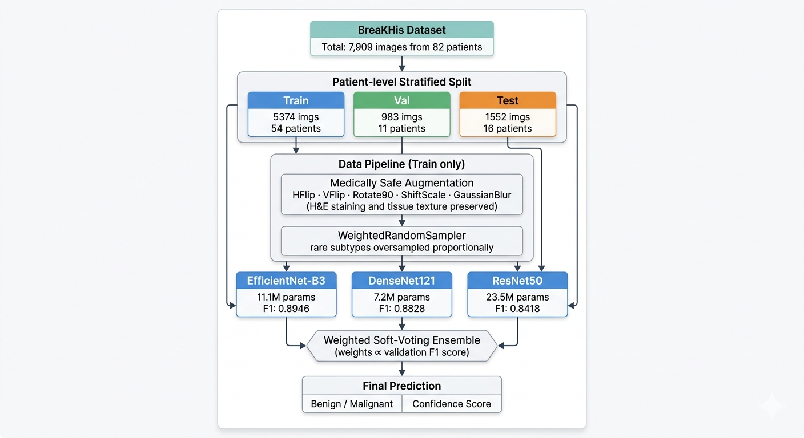
*Figure 4: End-to-end classification pipeline*


---

## 🏗️ Model Architecture

All three models use a custom two-layer classification head on top of pretrained ImageNet backbones:

```
Pretrained CNN Backbone
        │
        ▼
  BatchNorm1d → Dropout(0.4) → Linear(→256) → ReLU
        │
        ▼
  BatchNorm1d → Dropout(0.3) → Linear(→2)
        │
        ▼
  Softmax → [P(Benign), P(Malignant)]
```

### Training Configuration

| Parameter | Value |
|-----------|-------|
| Epochs | 30 (early stopping, patience=8) |
| Head learning rate | 1e-4 |
| Backbone learning rate | 1e-5 (differential LR) |
| Scheduler | CosineAnnealingLR |
| Optimizer | AdamW (weight_decay=1e-4) |
| Loss function | CrossEntropyLoss with class weights |
| Batch size | 32 |
| Image size | 224 × 224 |
| Mixed precision | Yes (torch.cuda.amp) |
| Hardware | NVIDIA Tesla T4 (Kaggle Free GPU) |

---
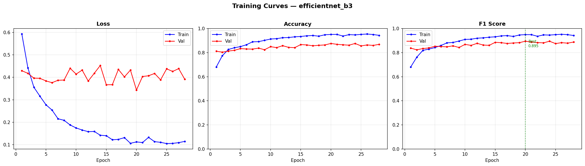
*Figure 5a: EfficientNetB3 training curves — Loss, Accuracy, F1 (Best val F1 = 0.8946)*

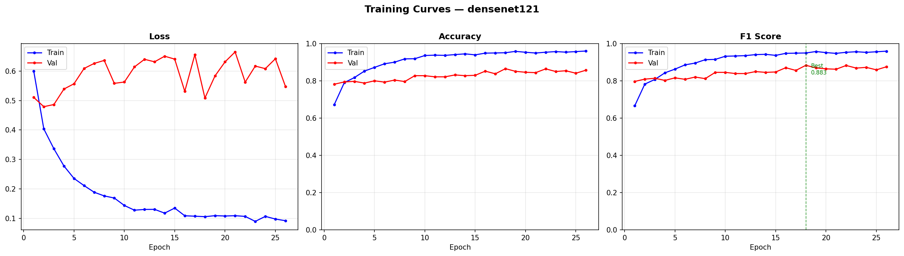
*Figure 5b: DenseNet121 training curves — Loss, Accuracy, F1 (Best val F1 = 0.8828)*

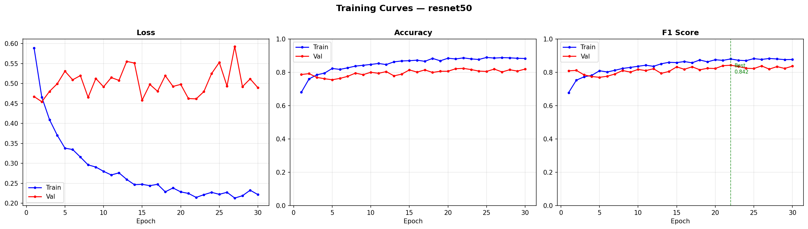
*Figure 5c: ResNet50 training curves — Loss, Accuracy, F1 (Best val F1 = 0.8418)*

---

## 📊 Evaluation

### Confusion Matrices — Test Set
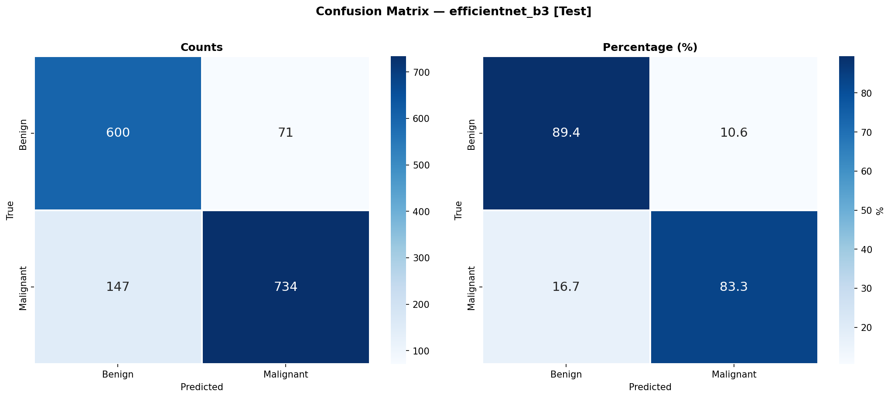
*Figure 6a: Confusion matrix — EfficientNetB3 on test set*

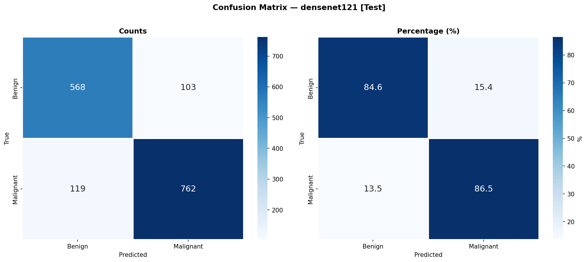
*Figure 6b: Confusion matrix — DenseNet121 on test set*

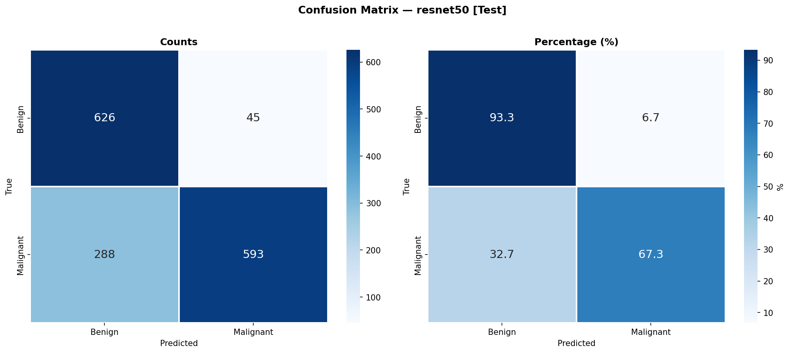
*Figure 6c: Confusion matrix — ResNet50 on test set*

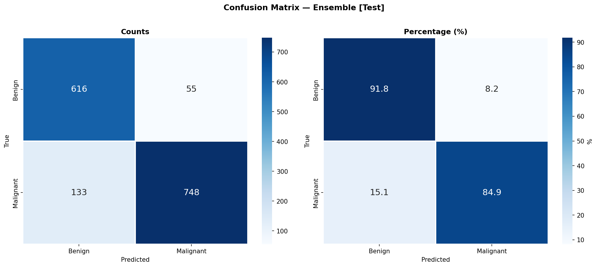
*Figure 6d: Confusion matrix — Ensemble on test set*

### ROC-AUC Curves — Test Set

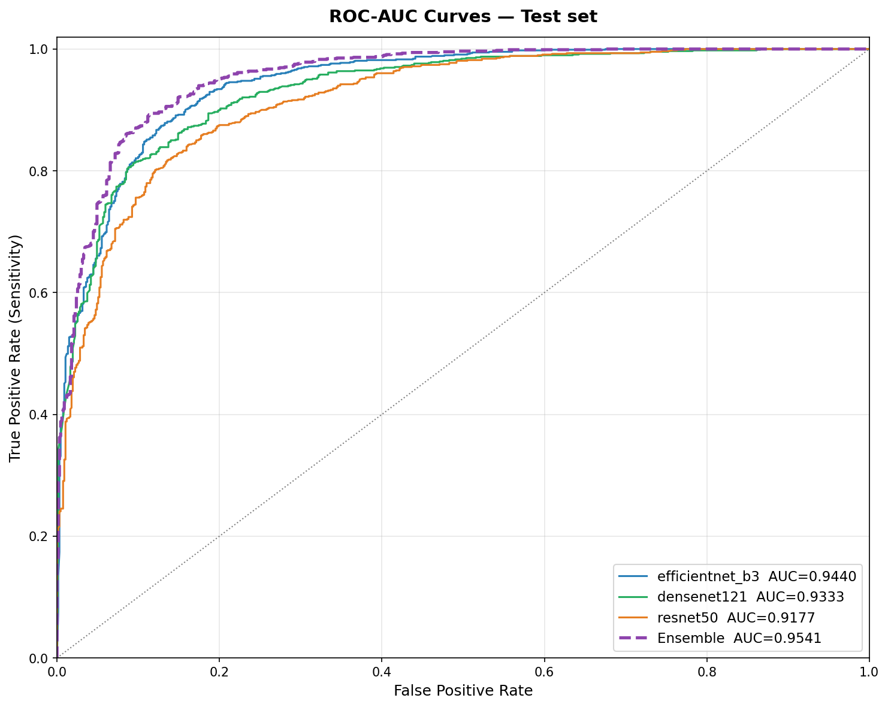
*Figure 7: ROC-AUC curves for all models on test set — Ensemble AUC = 0.9541*


### Per-class Metrics — Test Set

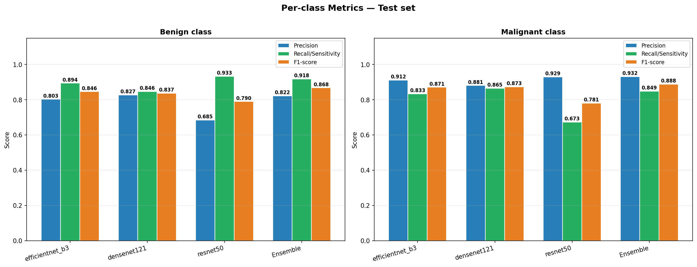
*Figure 8: Per-class Precision, Recall/Sensitivity, F1-score on test set*

---

## 🔍 Interpretability

### Grad-CAM Heatmaps

Gradient-weighted Class Activation Mapping (Grad-CAM) highlights which regions of the histopathology image each model focuses on when making its prediction. Correct predictions are shown with a ✓, incorrect with ✗.

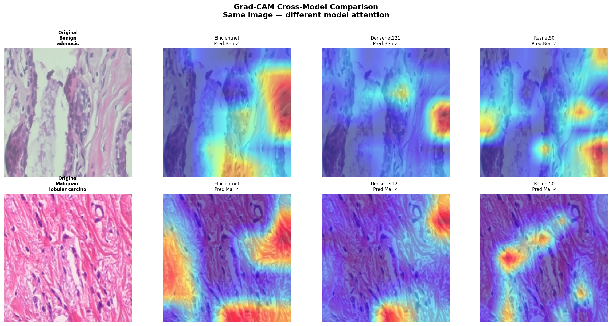
*Figure 9: Grad-CAM cross-model comparison — same image viewed by EfficientNetB3, DenseNet121, and ResNet50*

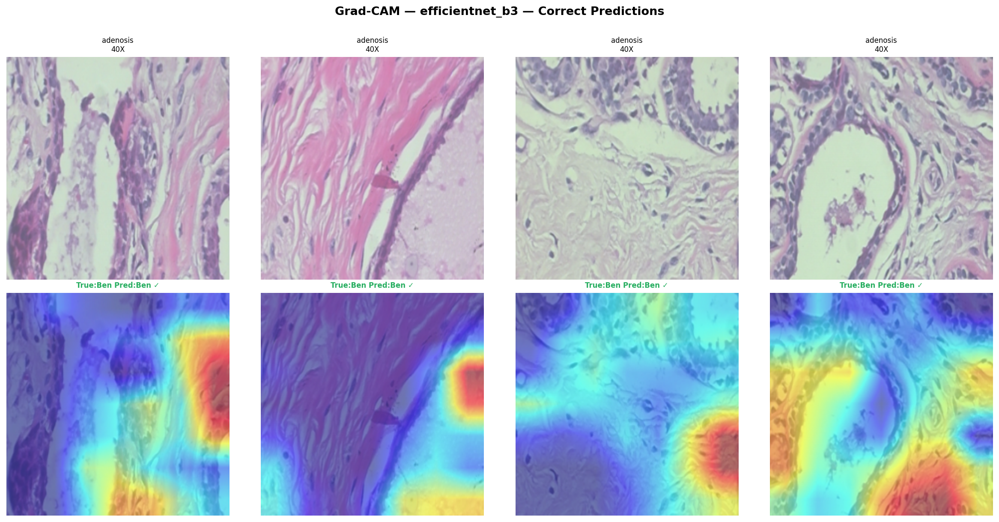
*Figure 10a: Grad-CAM — EfficientNetB3 correct predictions*

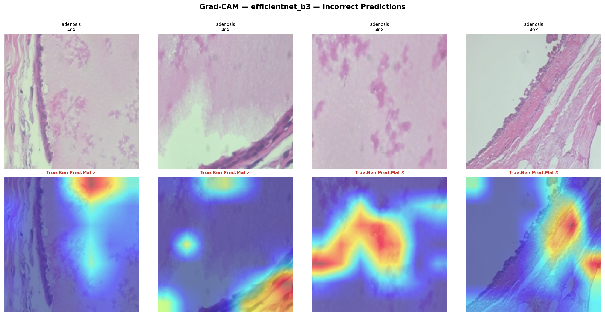
*Figure 10b: Grad-CAM — EfficientNetB3 incorrect predictions*

### LIME Explanations

LIME (Local Interpretable Model-agnostic Explanations) highlights superpixel regions that **support** (green) or **contradict** (red) the model's prediction at the local image level.

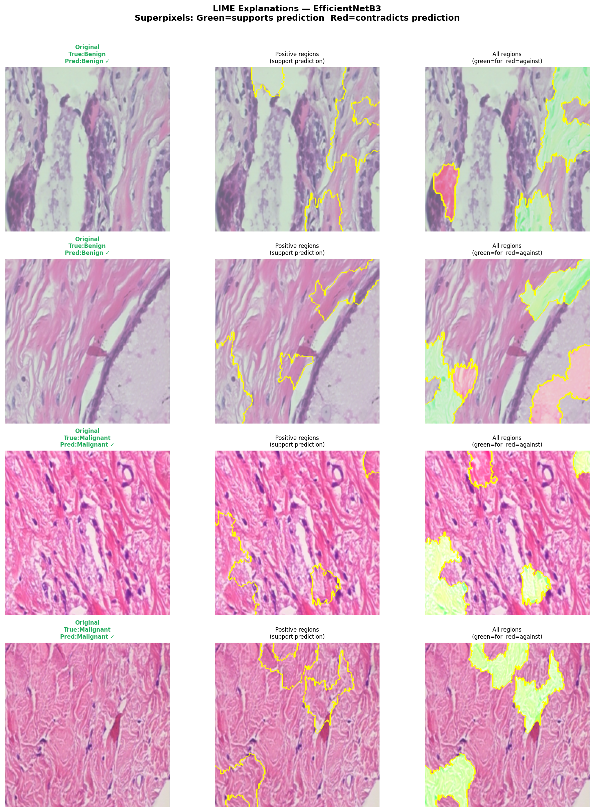
*Figure 11: LIME superpixel explanations — EfficientNetB3 on 4 test samples (2 benign, 2 malignant)*

### Feature Maps

Intermediate layer activations showing how the model progressively learns from low-level edge and texture features to high-level tissue morphology patterns.

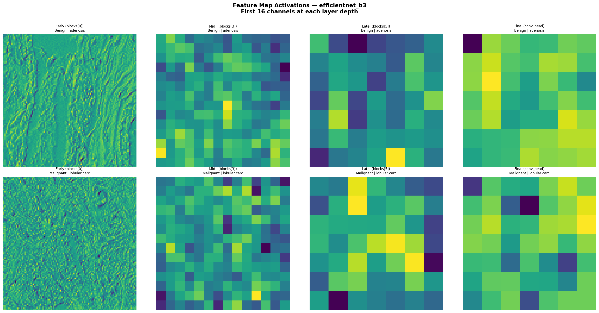
*Figure 12: Intermediate feature map activations — EfficientNetB3 across 4 network depths*

### Confidence Distribution and Error Analysis

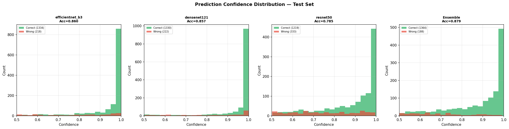
*Figure 13: Prediction confidence — correct vs incorrect predictions across all models*

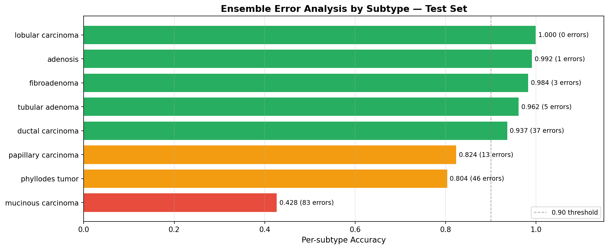
*Figure 14: Ensemble per-subtype accuracy on test set — identifying difficult subtypes*

---

## 📁 Repository Structure

```
breast-cancer-detection/
│
├── app.py                           # Gradio demo interface
├── requirements.txt                 # Python dependencies
├── README.md                        # Project documentation
│
├── models/
│   ├── efficientnet_b3_best.pth
│   ├── densenet121_best.pth
│   ├── resnet50_best.pth
│   └── ensemble_weights.json
│
├── results/
│   ├── training_curves_*.png
│   ├── confusion_{val,test}_*.png
│   ├── roc_auc_{val,test}_all.png
│   ├── per_class_{val,test}.png
│   ├── model_comparison_test.png
│   ├── sample_images.png
│   ├── class_distribution.png
│   ├── augmentation_preview.png
│   ├── all_metrics.json
│   ├── gradcam/
│   ├── lime/
│   ├── features/
│   ├── metrics/
│   ├── predictions/
│   └── ensemble/
│
├── splits/
│   ├── train_split.csv
│   ├── val_split.csv
│   ├── test_split.csv
│   └── label_mapping.json
│
├── notebooks/
│   └── breakhis-bcd-finalvers.ipynb
│
└── examples/
    ├── benign_adenosis.png
    ├── benign_fibroadenoma.png
    ├── benign_phyllodes_tumor.png
    ├── benign_tubular_adenoma.png
    ├── malignant_ductal_carcinoma.png
    ├── malignant_lobular_carcinoma.png
    ├── malignant_mucinous_carcinoma.png
    └── malignant_papillary_carcinoma.png

```

---

## 🚀 How to Run

### 🌐 Live Demo — no installation needed

Try the app directly in your browser:

🔗 [Open Live Demo](https://huggingface.co/spaces/kanchansaxena/breast-cancer-detection)

Upload any breast histopathology image and get an instant prediction.

---

### View the full training notebook

🔗 [Open on Kaggle](https://www.kaggle.com/code/kanchansaxena8808/breakhis-bcd-finalvers)

All training, evaluation, Grad-CAM, LIME, and feature analysis code with full cell outputs is available in the public Kaggle notebook.

### Run the Gradio demo locally

```bash
# 1. Clone the repository
git clone https://github.com/kanchansaxena8808/breast-cancer-detection.git
cd breast-cancer-detection

# 2. Install dependencies
pip install -r requirements.txt

# 3. Run the demo
python app.py
```

Open your browser at `http://localhost:7860` and upload any breast histopathology PNG image to get a prediction with confidence scores.

> **Note:** Model weight files (.pth) are tracked with Git LFS.
> Install Git LFS before cloning if you need the model files:
> ```bash
> git lfs install
> git clone https://github.com/kanchansaxena8808/breast-cancer-detection.git
> ```

---

## ⚠️ Limitations

- **Phyllodes Tumor** has only 3 patients and 60 training images — the rarest subtype in BreaKHis. Per-subtype accuracy for this class is lower than others due to this inherent dataset constraint.
- **Binary scope** — the model classifies Benign vs Malignant only. 8-class subtype-level classification is not included in this version.
- **Validation set size** — 983 images across 11 patients means validation metrics have higher variance than test metrics.
- **Dataset-specific generalisation** — trained exclusively on BreaKHis. Performance on images from different scanners, staining protocols, or institutions may vary.
- **Not for clinical use** — this is an academic research project. All predictions must be verified by qualified medical professionals.

---

## 📚 References

1. Spanhol, F. A., et al. (2016). *A Dataset for Breast Cancer Histopathological Image Classification.* IEEE Transactions on Biomedical Engineering, 63(7), 1455–1462.
2. Tan, M., & Le, Q. (2019). *EfficientNet: Rethinking Model Scaling for Convolutional Neural Networks.* ICML.
3. Huang, G., et al. (2017). *Densely Connected Convolutional Networks.* CVPR.
4. He, K., et al. (2016). *Deep Residual Learning for Image Recognition.* CVPR.
5. Selvaraju, R. R., et al. (2017). *Grad-CAM: Visual Explanations from Deep Networks via Gradient-based Localization.* ICCV.
6. Ribeiro, M. T., et al. (2016). *"Why Should I Trust You?": Explaining the Predictions of Any Classifier.* KDD.
7. Lin, T. Y., et al. (2017). *Focal Loss for Dense Object Detection.* ICCV.

---

## 👩‍🎓 Author

**Kanchan Saxena**
M.Sc. 
Department of Computer Science
University of Lucknow

---

## 📄 License

This project is licensed under the MIT License — see the [LICENSE](LICENSE) file for details.

---

> **Disclaimer:** This software is developed for academic research and educational
> purposes only. It is not a substitute for professional medical diagnosis or
> clinical decision-making. Always consult a qualified medical professional
> for health-related decisions.
